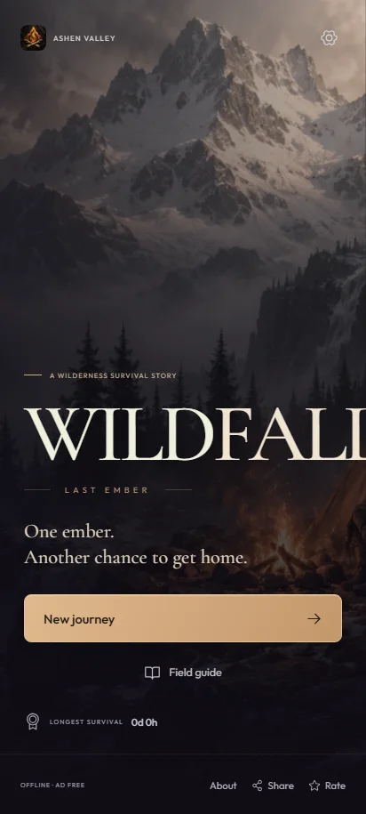
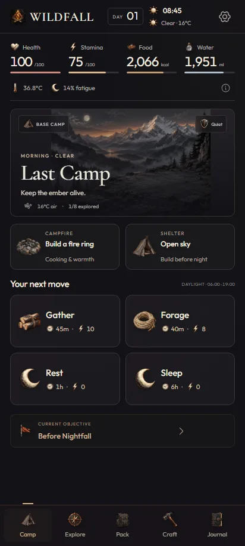
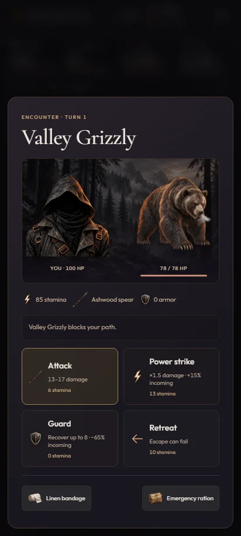

# WILDFALL: Last Ember

An original, fully offline 2D wilderness survival game for Android. Read the land, build a refuge, and repair a radio to find your way home.

**v1.1.0 — Ash & Copper.** English interface, original generated illustrations, compact mobile panels, action and battle animation, physical foley and nature ambience. **No music, melodies, instrument samples, or tonal UI beeps.**

  

## Install

[Download the APK](https://github.com/fareza777/survival-wild-ember/releases/latest/download/WILDFALL-Last-Ember-1.1.0.apk), or use `dist/WILDFALL-Last-Ember-1.1.0.apk`. The checksum is in `dist/SHA256.txt`.

Requires Android 8.0+ (API 26) and Android System WebView 108+. Universal ARM/x86 APK; no network permission, account, ads, or runtime downloads. Open the APK on your phone and allow installation from your file manager if Android prompts you. This standalone build uses the project's development certificate; it is not a Play Store release.

## Play

- Eight connected locations, 36 items, 26 recipes, five main quests and ten side objectives.
- Three starting scenarios, three difficulty levels, optional permadeath, dawn recovery and longest survival records.
- Health, stamina, calories, hydration, temperature, fatigue, injury and sickness.
- Day/night, six weather types, increasing exposure and encounter risk, location progression and random choices with consequences.
- Gathering, foraging, hunting, fishing, timed snares, cooking, durable equipment, repair and pack capacity.
- Three shelter levels, fire and fuel, a rain collector, a garden, radio rescue and endless survival.
- Turn-based battle: attack, power strike, guard, retreat and supply use. Equipment, arrows, preparation and stamina matter.
- Menu, onboarding, settings, guide, about, native Android sharing and local rating.

The camp keeps primary actions within reach. Gather, eat, drink and eligible crafting take one tap. Inventory and recipes use short pages and category menus; quests show one objective at a time. Detailed item and action information opens on demand. Reduced motion, larger text, haptics, effects volume and ambience volume are configurable.

Gather firewood, flint stone and fiber. Build a fire ring and shelter, then add fuel. Eat and drink from Pack. **Equip crafted gear**: crafting alone does not equip it. Explore the forest to unlock the river and boil its water at camp. Cook raw food before eating.

The rescue route leads through the river and cabin to the ruins and cave. Recover the journal and radio module, equip a torch and carry a working axe to mine copper. Make a battery and radio at camp. Transmit at Hope Summit in clear/cloudy daylight; the 30-minute transmission must finish before 19:00. Start with Explorer / Riverborn for a gentler first journey.

## Architecture

Vanilla ES modules and JSON catalogs keep the simulation separate from presentation. `web/game/` contains the action engine, seeded RNG, metabolism, inventory, combat, quests and storage. `web/ui/` contains views, paging, motion and audio. The small Java host in `android/src/` provides local asset loading, native backup, haptics, sharing and Back handling.

Add content in `web/data/`: items, recipes, locations, events, enemies, weather, scenarios and quests. Each entry references local art. Cost preview and execution share the same exposure/metabolism code. Every accepted action saves before its animation starts. Compatible version-1 saves and dawn checkpoints are retained.

## Preview and verification

Node.js 20+:

```powershell
npm ci
npm start
# Open http://127.0.0.1:4173 in another window.
npm test
npm run check
npm run qa
```

Browser QA uses Playwright. If Chromium is not installed, run `npx playwright install chromium`; alternatively set `PLAYWRIGHT_CHROMIUM_EXECUTABLE`. On Windows the test also locates an existing Playwright browser cache. Android QA uses `ADB` and `ANDROID_SERIAL` (defaults: `C:/Android/Sdk/platform-tools/adb.exe` and `emulator-5580`) with an installed, running APK:

```powershell
npm run qa:android
node tools/playthrough.mjs story riverborn 7103
node tools/playthrough.mjs survivor riverborn 7103
python tools/verify-package.py
```

The two rescue routes obtain supplies through public gameplay actions, without injecting resources or resetting statistics. Controlled browser fixtures separately test particular combat, art and audio states. See [verification evidence](docs/VERIFICATION.md) for scope and results. Balance across all seeds still benefits from human playtesting; automated rules coverage is not a universal winning strategy.

## Build Android

JDK 17+, Android SDK platform 35, build-tools 35.0.0 and PowerShell. No Gradle or Android Studio is required.

```powershell
npm run android
# Optional explicit tool paths:
powershell -ExecutionPolicy Bypass -File tools/build-android.ps1 -SdkPath C:\Android\Sdk -JavaPath "C:\Program Files\Microsoft\jdk-21.0.11.10-hotspot"
```

The pipeline compiles resources and Java, converts to DEX, bundles all local web assets with standard ZIP paths, aligns, signs and verifies the APK, then writes SHA-256. It preserves your local development keystore for subsequent updates. Private keys and build caches are excluded from Git; a fresh clone creates its own development certificate. Use a separate production keystore for store publication.

## Art and audio

77 original generated assets cover every item, enemy, environment, survivor, camp structure, gameplay symbol, title illustration and app emblem. All human faces are completely concealed. Originals and individual prompts are retained in `art/generated/` and [art/catalog.json](art/catalog.json). Runtime WebP assets are resized and format-converted only. `npm run assets` repeats conversion using Sharp; camp structures and fire are separate layers driven by game state.

16 selected physical foley clips come from Kenney RPG Audio and Impact Sounds (CC0). Wind, rain, flowing water and fire use original filtered broadband noise. Ambience crossfades with location, weather and fuel; all audio pauses in the background. Both sound channels have independent controls. Full credits are in [audio/SOURCES.md](web/assets/audio/SOURCES.md). `tools/prepare-audio.mjs` documents the exact sample mapping; runtime clips are already included.

Utility interface icons: Phosphor (MIT). Fonts: Outfit, Cormorant Garamond and the legacy Barlow Condensed fallback (SIL OFL). Their licenses are bundled. Original project source is MIT; third-party licenses remain applicable. No reference-game assets or UI were copied.

Ratings are saved locally until there is an actual store listing. Device verification used an Android emulator; physical phone and speaker validation remain unverified.
